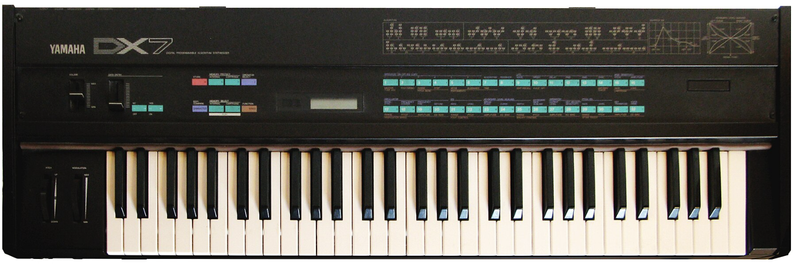

<p align="center">
  
</p>

# DX7

A Yamaha DX7 FM synthesizer emulator in Rust.

## Demo

E.PIANO 1 solo — "Greatest Love of All" intro (DX7's iconic FM electric piano):

- [E.Piano 1 Intro](demo/epiano1_intro_demo.wav)

Full GM MIDI rendering with 128-program sound set:

- [Greatest Love of All](demo/Greatest-Love-Of-All-1.wav)

## Structure

- **dx7-core** — Platform-independent synthesis engine (no-std capable, zero dependencies)
- **dx7-app** — CLI application with real-time audio, MIDI input, keyboard control, and MIDI file rendering

## Build

```
cargo build --release
```

## Usage

### Interactive mode

Play with computer keyboard or a connected MIDI controller:

```
cargo run --release --package dx7-app
```

Keyboard controls:
- `ASDFGHJKL;` — white keys (C4-E5)
- `WETYUOP` — black keys
- `Z/X` — octave down/up
- `1-9,0` — select patch
- `Q/Esc` — quit

### Load patches from SysEx

```
cargo run --release --package dx7-app -- --sysex sysex/rom1a.syx --patch 0
```

### Render a single note to WAV

```
cargo run --release --package dx7-app -- --render output.wav --note 60 --velocity 100 --duration 3
```

### Render a MIDI file to WAV

```
cargo run --release --package dx7-app -- --midi-file song.mid --sysex sysex/rom1a.syx --patch 3 --render output.wav
```

### GM mode

Render a MIDI file using the built-in General MIDI sound set (128 programs mapped to DX7 patches):

```
cargo run --release --package dx7-app -- --midi-file song.mid --render output.wav --gm
```

Use `--track 1 --track 2` to render specific tracks only.

### List MIDI ports

```
cargo run --release --package dx7-app -- --list-midi
```

## Factory ROMs

The `sysex/` directory contains the four official DX7 factory ROM banks:

- `rom1a.syx` — ROM1A (also compiled into dx7-core as built-in presets)
- `rom1b.syx` — ROM1B
- `rom2a.syx` — ROM2A
- `rom2b.syx` — ROM2B

## Engine

- 6 identical FM operators with 32 algorithm topologies
- 24-bit phase accumulator, 10-bit sine ROM in log domain
- Integer log/exp domain math matching the YM21280 OPS chip
- Per-operator amplitude envelopes, pitch envelope, LFO
- 4th-order Butterworth output filter at 10.5 kHz (DX7 reconstruction filter)
- DC-blocking filter, stereo reverb, and soft saturation
- GM sound set with 128 programs and synthesized drum machine (channel 10)

## Reference

- [music-synthesizer-for-android](https://github.com/google/music-synthesizer-for-android) (msfa) engine
- [Dexed](https://github.com/asb2m10/dexed)
